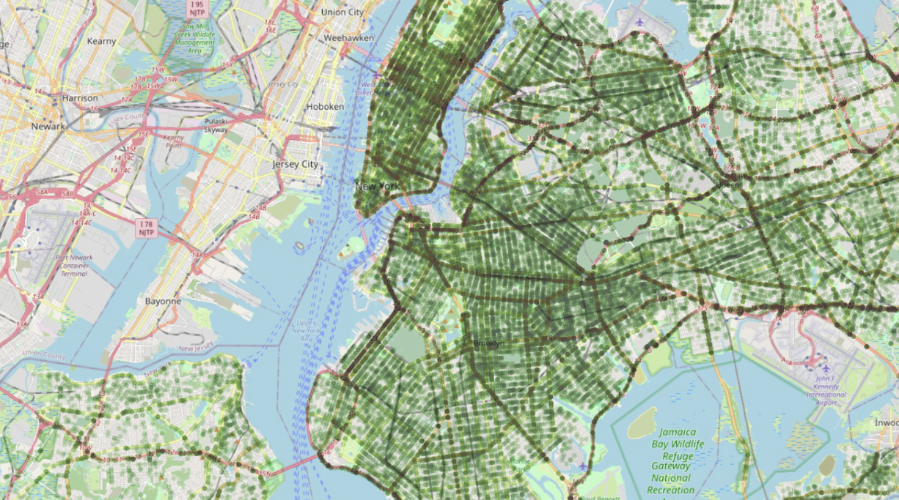

# NYC_Accident_Analysis

**Project Overview:**  
1.) What areas in NYC have the most accidents? Where are the most severe accidents located?

2.) What are the causes of most accidents? Can the contributing factors for the vehicles be classified?

3.) What time of day do the accidents occur and where?

4.) When did the Alcohol envolvment happen?

5.) What types of accidents are the most severe? What have the highest average severity rating per accident? 

**Methodology:**
* Data Acquisition: Data was collected from kaggle New York Traffic Accidents. See
https://www.kaggle.com/datasets/mysarahmadbhat/nyc-traffic-accidents

**Results and Outcomes:**

Markdown

**Challenges and Lessons Learned:**

**Additional Information:**
*
Keywords: 
